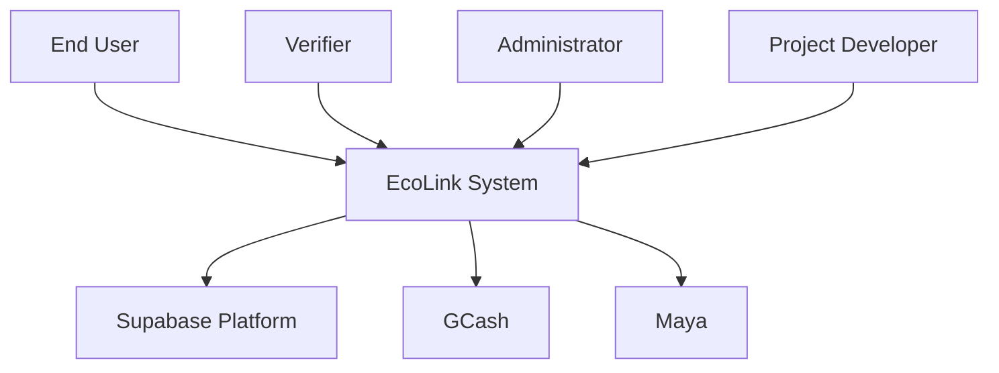
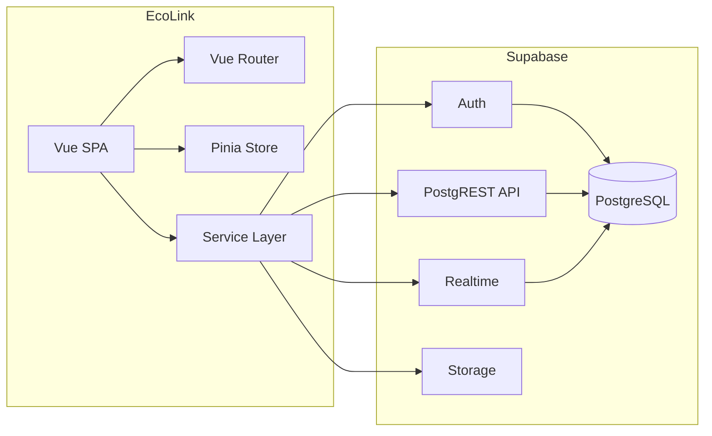
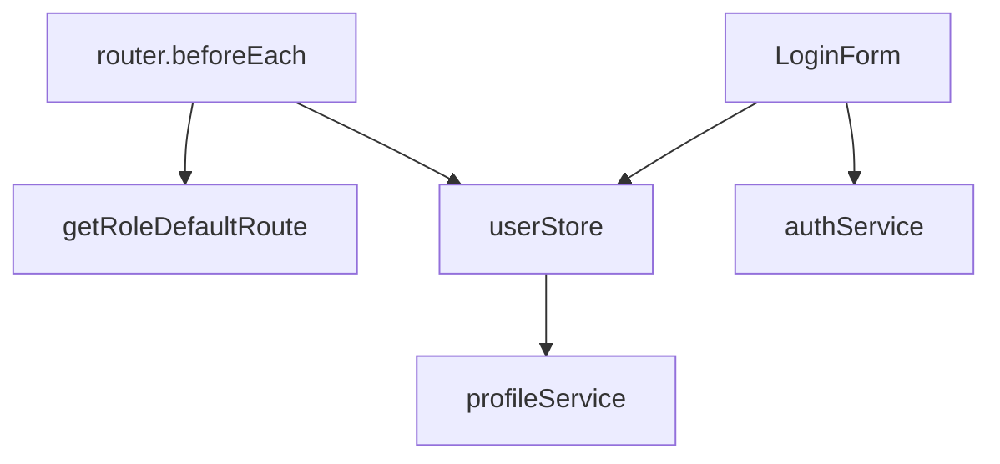

# EcoLink C4 Model

This document provides C4 Context and Container diagrams tailored to EcoLink.

## Level 1: System Context

```mermaid
graph TD
  User[End User]
  Verifier[Verifier]
  Admin[Administrator]
  Dev[Project Developer]
  Eco[EcoLink System]
  GCash[GCash]
  Maya[Maya]
  Supabase[Supabase Platform]

  User --> Eco
  Verifier --> Eco
  Admin --> Eco
  Dev --> Eco

  Eco --> Supabase
  Eco --> GCash
  Eco --> Maya
```

## Level 2: Containers

```mermaid
graph LR
  subgraph EcoLink
    SPA[Vue SPA]
    Router[Vue Router]
    Store[Pinia Store]
    Services[Service Layer]
  end

  subgraph Supabase
    Auth[Auth]
    API[PostgREST API]
    DB[(PostgreSQL)]
    Realtime[Realtime]
    Storage[Storage]
  end

  SPA --> Router
  SPA --> Store
  SPA --> Services
  Services --> Auth
  Services --> API
  Services --> Realtime
  Services --> Storage
  Auth --> DB
  API --> DB
  Realtime --> DB
```

## Level 3: Key Components (Frontend)

```mermaid
graph TD
  Login[LoginForm]
  Guard[router.beforeEach]
  RoleRoute[getRoleDefaultRoute]
  UserStore[userStore]
  ProfileSvc[profileService]
  AuthSvc[authService]

  Login --> AuthSvc
  Login --> UserStore
  UserStore --> ProfileSvc
  Guard --> UserStore
  Guard --> RoleRoute
```

