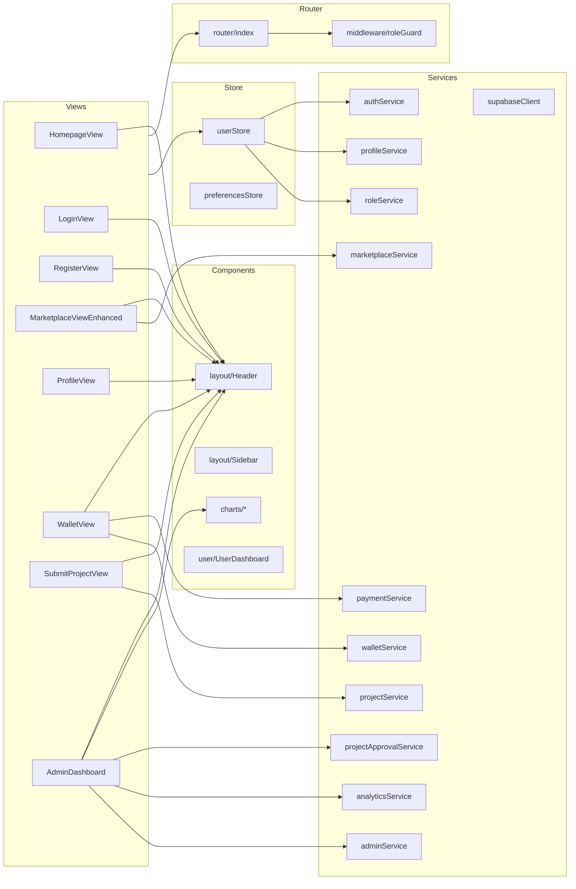

# EcoLink Component Diagram (Frontend + Services)

```mermaid
graph LR
  subgraph Views
    Homepage[HomepageView]
    Login[LoginView]
    Register[RegisterView]
    Marketplace[MarketplaceViewEnhanced]
    Profile[ProfileView]
    Wallet[WalletView]
    SubmitProject[SubmitProjectView]
    Admin[AdminDashboard]
  end

  subgraph Components
    Header[layout/Header]
    Sidebar[layout/Sidebar]
    Charts[charts/*]
    UserDash[user/UserDashboard]
  end

  subgraph Store
    UserStore[userStore]
    PrefStore[preferencesStore]
  end

  subgraph Services
    AuthSvc[authService]
    ProfileSvc[profileService]
    RoleSvc[roleService]
    ProjectSvc[projectService]
    ApprovalSvc[projectApprovalService]
    MarketSvc[marketplaceService]
    PaymentSvc[paymentService]
    WalletSvc[walletService]
    AnalyticsSvc[analyticsService]
    AdminSvc[adminService]
    Supabase[supabaseClient]
  end

  subgraph Router
    RouterIdx[router/index]
    RoleGuard[middleware/roleGuard]
  end

  Homepage --> Header
  Login --> Header
  Register --> Header
  Marketplace --> Header
  Profile --> Header
  Wallet --> Header
  SubmitProject --> Header
  Admin --> Header
  Admin --> Charts

  Views --> RouterIdx
  RouterIdx --> RoleGuard

  Views --> UserStore
  UserStore --> AuthSvc
  UserStore --> ProfileSvc
  UserStore --> RoleSvc

  Marketplace --> MarketSvc
  SubmitProject --> ProjectSvc
  Admin --> ApprovalSvc
  Admin --> AnalyticsSvc
  Wallet --> PaymentSvc
  Wallet --> WalletSvc
  Admin --> AdminSvc

  Services --> Supabase
```

