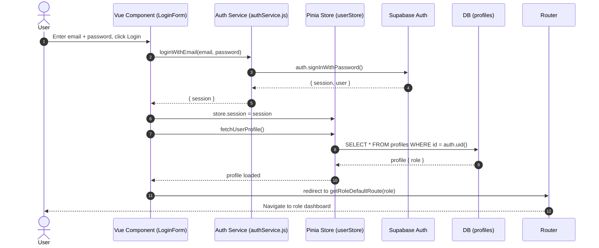
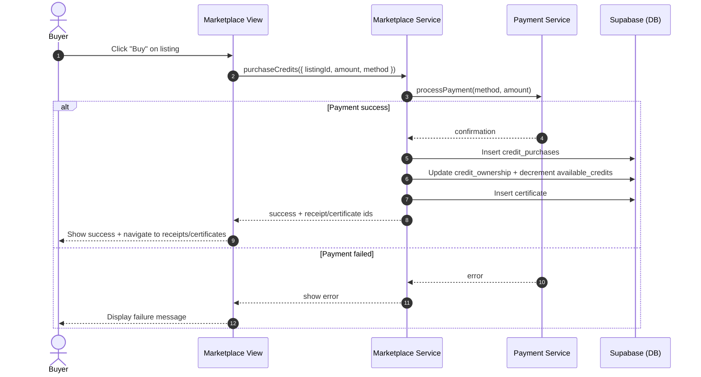
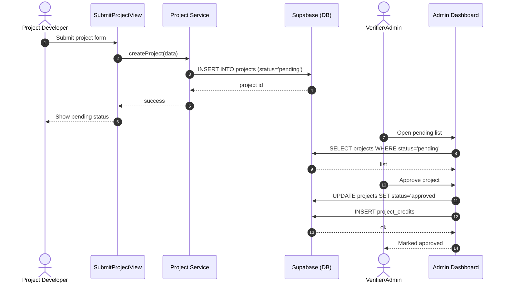

# EcoLink Sequence Diagrams

These Mermaid sequence diagrams reflect the actual flows implemented in `src/router/index.js`, `src/components/auth/LoginForm.vue`, and services under `src/services/`.

## 1) User Login Flow (Email/Password)



## 2) Page Refresh Session Restore

```mermaid
sequenceDiagram
autonumber
participant B as Browser
participant R as Router Guard
participant ST as Pinia Store (userStore)
participant SB as Supabase Auth
participant DB as DB (profiles)

B->>R: Navigation (after refresh)
R->>ST: if (!session) fetchSession()
ST->>SB: auth.getSession()
alt Session exists
  SB-->>ST: { session }
  ST->>DB: getProfile(userId)
  DB-->>ST: profile { role }
  R-->>B: allow/redirect based on role
else No session yet
  R->>SB: auth.getSession() (direct fallback)
  SB-->>R: { session? }
  alt Found
    R->>ST: restore session; fetchUserProfile()
    ST->>DB: SELECT profile
    DB-->>ST: profile
    R-->>B: continue
  else Not found
    R-->>B: redirect to /login (with returnTo)
  end
end
```

## 3) Credit Purchase Flow



## 4) Project Submission and Approval




