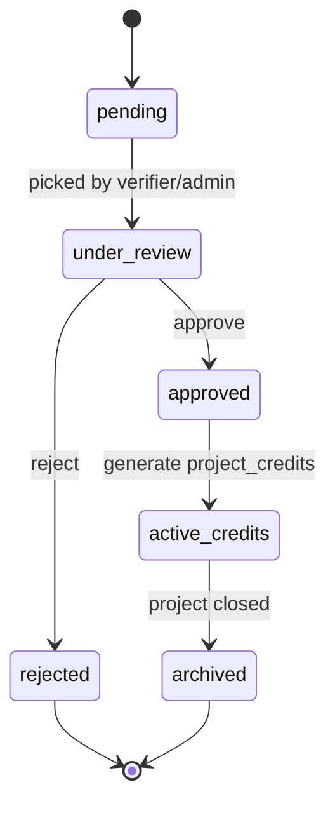
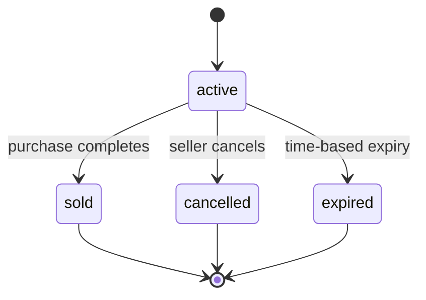
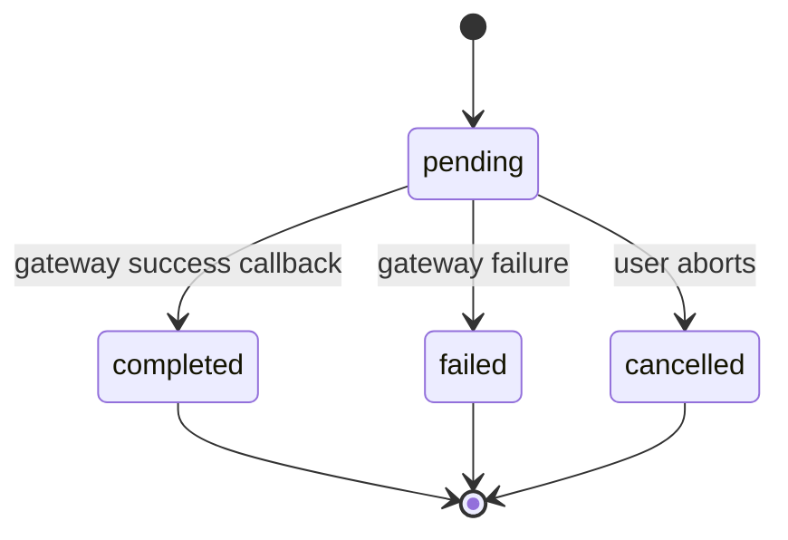
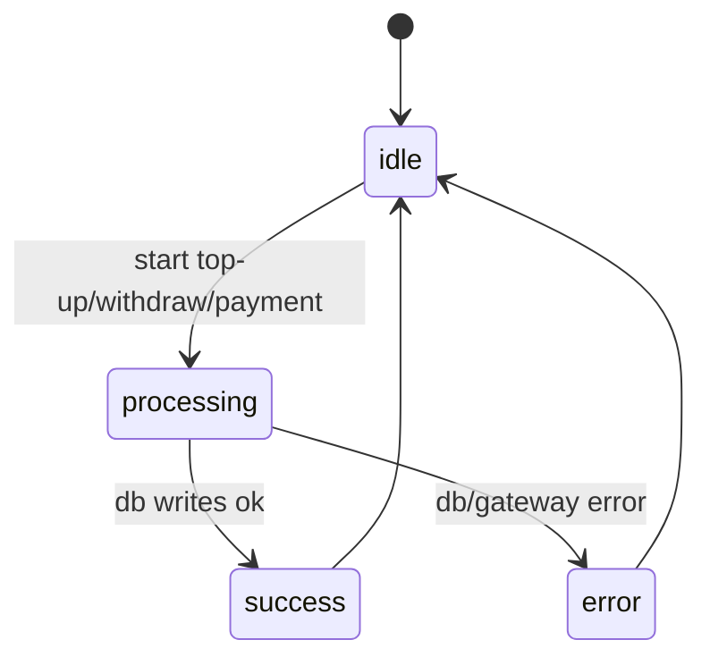

# EcoLink State Machines

## 1) Project Lifecycle

```mermaid
stateDiagram-v2
  [*] --> pending
  pending --> under_review: picked by verifier/admin
  under_review --> approved: approve
  under_review --> rejected: reject
  approved --> active_credits: generate project_credits
  rejected --> [*]
  active_credits --> archived: project closed
  archived --> [*]
```

## 2) Credit Listing Status

```mermaid
stateDiagram-v2
  [*] --> active
  active --> sold: purchase completes
  active --> cancelled: seller cancels
  active --> expired: time-based expiry
  sold --> [*]
  cancelled --> [*]
  expired --> [*]
```

## 3) Payment Transaction Status

```mermaid
stateDiagram-v2
  [*] --> pending
  pending --> completed: gateway success callback
  pending --> failed: gateway failure
  pending --> cancelled: user aborts
  completed --> [*]
  failed --> [*]
  cancelled --> [*]
```

## 4) Wallet Balance Update Flow (Abstract)

```mermaid
stateDiagram-v2
  [*] --> idle
  idle --> processing: start top-up/withdraw/payment
  processing --> success: db writes ok
  processing --> error: db/gateway error
  success --> idle
  error --> idle
```

